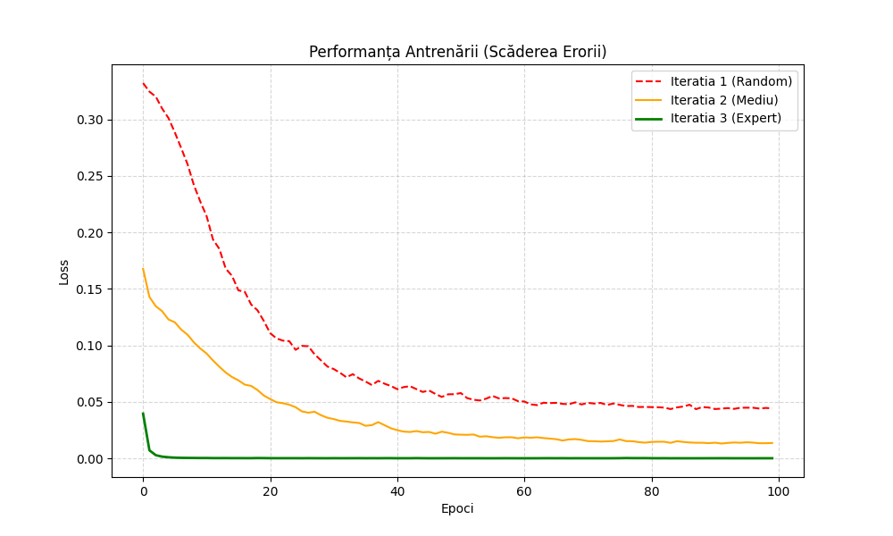
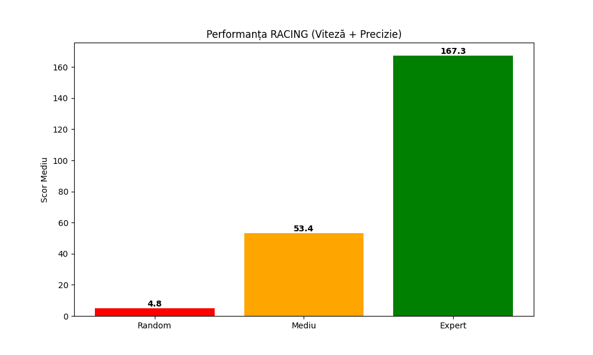
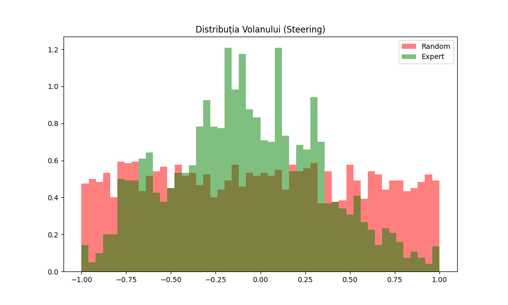

# Behavior Cloning pe HighwayEnv (Racetrack) 🚗💨

Acest proiect implementează un agent de **Reinforcement Learning** (mai exact **Behavior Cloning**) care învață să conducă autonom pe un circuit, imitând un expert.

Proiectul a fost realizat folosind librăriile `gymnasium`, `highway-env`, `stable-baselines3` și `pytorch`.

## 🛠️ Instalare

Clonează repository-ul:
```
git clone https://github.com/CristianPreda1609/HighwayEnv-Behavior-Cloning.git
cd HighwayEnv-Behavior-Cloning
```
## 📊 Rezultate (Modul Racing 🏎️)

Am antrenat agentul să imite un expert de tip "Racer", care prioritizează viteza și tăierea curbelor.

### 1. Evoluția Antrenării (Loss)

- **Verde (Expert):** Convergență rapidă spre 0. Rețeaua a învățat perfect corespondența dintre imaginile circuitului și comenzile de volan/accelerație.

### 2. Performanța Reală în Simulare (Reward Mediu)
Testare pe 5 curse de anduranță (Racing Reward: Viteză + Centrare).

- **Random:** Scor ~5 (Eșuează imediat).
- **Expert (Iterația 3):** Scor **167.3**. Acest scor demonstrează că agentul conduce cu viteză mare și reușește să finalizeze segmente lungi de circuit fără accident.

### 3. Analiza Comportamentului (Steering Histogram)
Cum manevrează agentul volanul?

- **Roșu (Random):** Zgomot uniform (comenzi haotice).
- **Verde (Expert):** Distribuție concentrată pe centru (mers stabil) cu vârfuri specifice pe laterale, corespunzătoare unghiurilor optime pentru curbele circuitului.